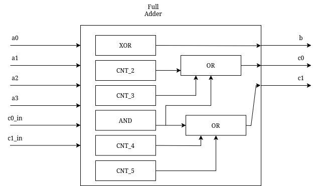
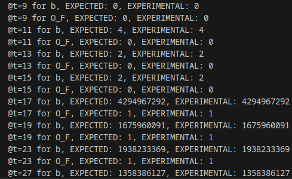

# Four Input Full Adder

A four-input adder implementation in SystemVerilog.

## Block Diagram

The full adder accepts four data inputs and two carry inputs, producing one data output and two carry outputs. This design accommodates sums ranging from 0 to 4, requiring both carry outputs to prevent overflow in multi-bit configurations, as opposed to a traditional 2-input full adder which has a maximum sum of 3 (requiring only one output and one carry to store).

## Implementation

**Location:** `src/rtl/four_input_full_adder`

The core logic comprises:
- 1× 6-input XOR gate
- 1× 6-input AND gate  
- 4× 6-input LUTs (implemented via case statements)

**Output Logic:**
- **Data Out:** XOR of all inputs (odd sum detection)
- **First Carry:** OR of sums equal to 2, 3, or 6 (second bit set)
- **Second Carry:** Sum greater than 3 (third bit set)

LUT modules were generated automatically using `src/scripts/generate_lut.cpp`.

## N-Bit Adder

**Location:** `src/rtl/four_input_adder.sv`

A parameterized N-bit adder using a ripple-carry architecture with O(n) critical path delay. A 32-bit implementation requires approximately 128 LUTs, not including the 6-input XOR and AND gates required, plus additional 3-input gates.

**Future Considerations:**  
Kogge-Stone architecture could reduce gate delay at the cost of increased resources. Comparative analysis needed between three cascaded 2-input adders and the native 4-input implementations.

## Testing

A UVM-style testbench was implemented in C++ using the Verilator:
- Randomized transaction generation
- Single driver/dual monitor architecture  
- Scoreboard with assertion-based verification
- Comprehensive test case coverage

Assertions were used to check all tests pass/fail status.